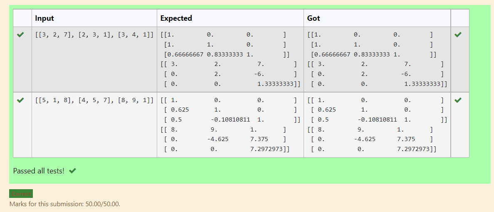
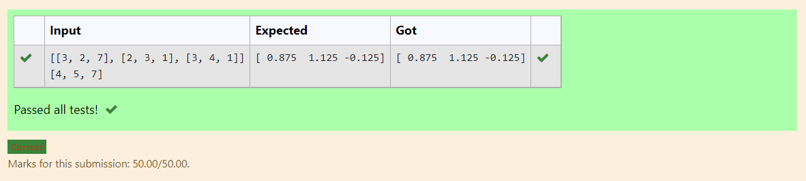

# LU Decomposition 

## AIM:
To write a program to find the LU Decomposition of a matrix.

## Equipments Required:
1. Hardware – PCs
2. Anaconda – Python 3.7 Installation / Moodle-Code Runner

## Algorithm
Step 1:
Import the numpy module to use the built-in functions for calculation.
Step 2:
From scipy.linalg module import the lu function
Step 3:
Get inputs from the user and assign the values in np.array().
Step 4:
Using the lu() function, we can find the L and U matrix.
Step 5:
Print the obtained values.
Step 6:
End the program. 

## Program:
(i) To find the L and U matrix
```
/*
Program to find the L and U matrix.
Developed by: Paarkavy B
RegisterNumber: 21500424
# To print L and U matrix
import numpy as np
from scipy.linalg import lu
#import scipy
A = np.array(eval(input()))
P,L,U =lu(A)
#P,L,U = scipy.linalg.lu(A)
print(L)
print(U)
*/
```
(ii) To find the LU Decomposition of a matrix
```
/*
Program to find the LU Decomposition of a matrix.
Developed by: Paarkavy B 
RegisterNumber: 21500424
# To print X matrix (solution to the equations)
import numpy as np
from scipy.linalg import lu_factor,lu_solve
A = np.array(eval(input()))
B = np.array(eval(input()))
lu,pivot = lu_factor(A)
x = lu_solve((lu,pivot),B)
print(x)
*/
```

## Output:



## Result:
Thus the program to find the LU Decomposition of a matrix is written and verified using python programming.

